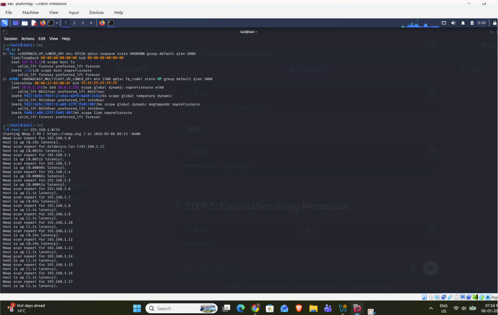
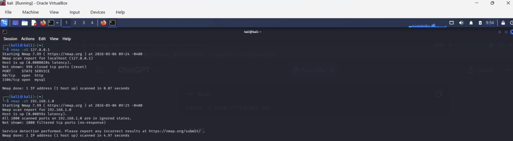
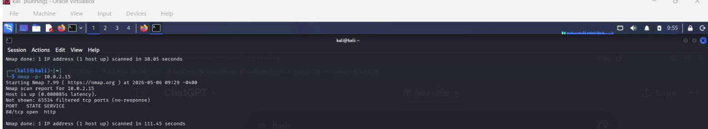
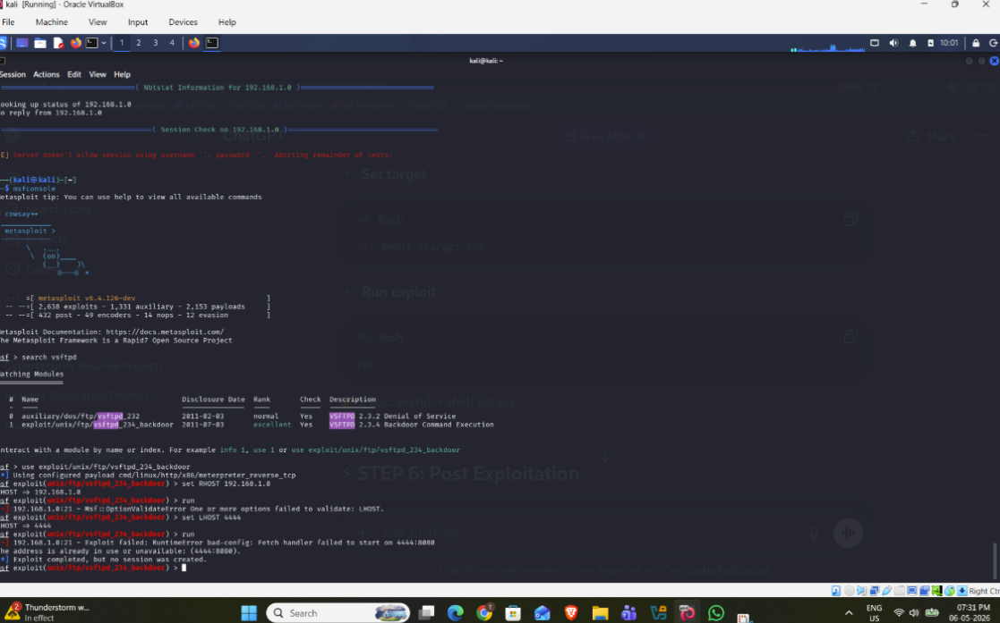
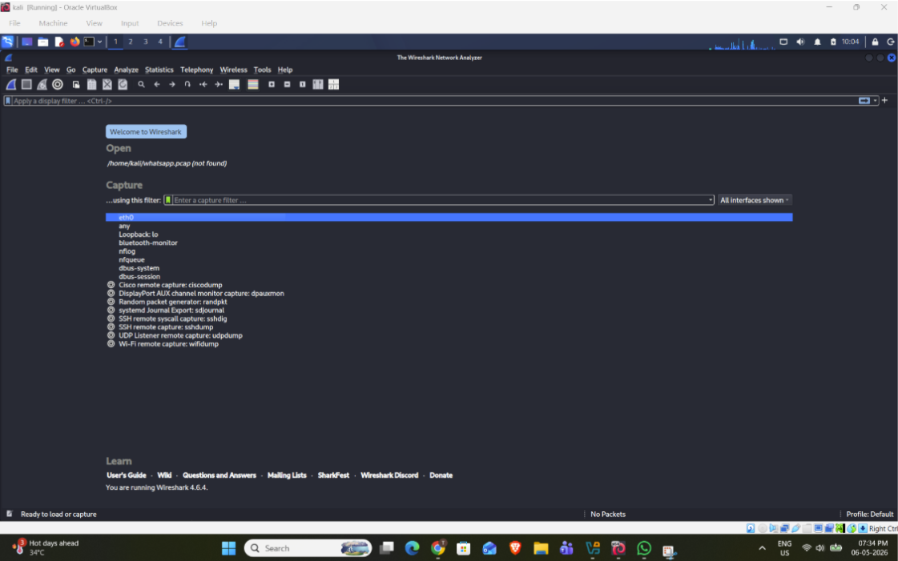
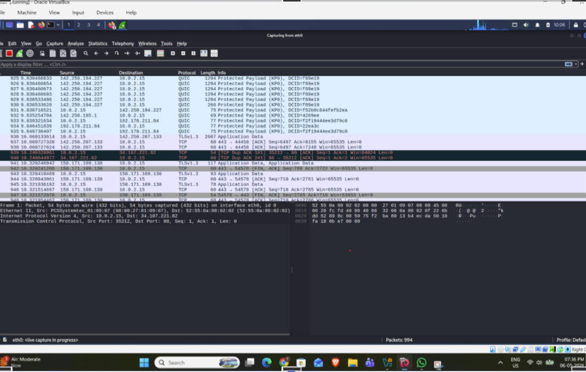

🔐 Network Penetration Testing & Exploitation Lab using Kali Linux

📌 Objective
To perform network penetration testing in a controlled lab environment to identify, analyze, and exploit vulnerabilities in a target system.

🛠️ Tools Used
Kali Linux
Nmap
Metasploit Framework
Wireshark

🧪 Lab Setup

Component	Details
Attacker Machine	Kali Linux
Target Machine	Metasploitable2 (Vulnerable VM)
Network	Virtual Lab Environment (isolated, host-only)

🔍 Methodology
1️⃣ Reconnaissance (Scanning)

Performed network scanning to identify live hosts, open ports, and running services.

2️⃣ Enumeration

Gathered detailed information about services and identified potential vulnerabilities.

3️⃣ Exploitation

Used Metasploit Framework to exploit an identified vulnerability (vsftpd 2.3.4 backdoor) and gain access to the system.

4️⃣ Post-Exploitation

Verified system access and analyzed compromised system behavior.

🔄 Attack Flow

Kali Linux → Nmap Scan → Vulnerability Identification → Exploitation (Metasploit) → System Access

⚡ Commands Used
bash
# Scan target for open ports and service versions
nmap -sV 192.168.1.5

# Launch Metasploit
msfconsole

# Search for a known exploit matching the identified service
search vsftpd

# Select and configure the exploit
use exploit/unix/ftp/vsftpd_234_backdoor
set RHOST 192.168.1.5
run

🧨 Vulnerabilities Identified
vsftpd 2.3.4 backdoor vulnerability (CVE-2011-2523)
Open ports exposing critical services (FTP, HTTP, HTTPS)
Weak authentication mechanisms

📊 Results:-

Discovered open ports (21, 80, 443)
Identified vulnerable services
Successfully exploited target system via the vsftpd backdoor
Gained unauthorized access using Metasploit
Demonstrated how attackers can gain unauthorized system access in a real-world attack scenario

---

## 📸 Screenshots

### 🔹 Nmap Scan

Performed service version detection to identify open ports and running services 

### 🔹 Exploitation using Metasploit

Successfully gained access to the target system

### 🔹 Wireshark Analysis

Captured and analyzed network traffic

[Wireshark packet capture](wireshark_capture.pcapng)

---

🔐 Security Recommendations
Close unused ports
Update and patch vulnerable services
Implement firewall rules
Use Intrusion Detection Systems (IDS)
Enforce strong authentication mechanisms

💡 What I Learned
How to perform structured recon → enumeration → exploitation → post-exploitation workflow
Mapping a discovered service version to a known CVE and matching Metasploit module
Reading and interpreting Wireshark captures to correlate exploitation activity with network traffic
Why patching and version management directly prevents this class of attack
📌 Conclusion

This project demonstrates practical implementation of penetration testing techniques including reconnaissance, enumeration, exploitation, and post-exploitation using Kali Linux tools. It highlights real-world vulnerabilities and emphasizes the importance of securing network systems.

⚠️ Disclaimer

This project was conducted in a controlled, isolated lab environment for educational purposes only. Unauthorized testing on systems you do not own or have explicit permission to test is illegal.

---

## 📄 Full Report

[Click here to view detailed report](Report.md )

